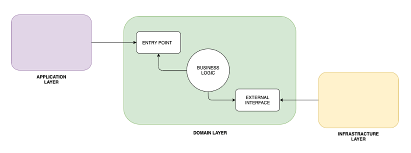

# [Projeto Tech Challenge](https://github.com/ribeirofeu/techchallenge-soat1-fase1)



> Este serviço tem como objetivo gerenciar pedidos de uma lanchonete de forma organizada e com rastreabilidade durante todo o processo, desde o pedido a entrega

### Stack

O projeto ainda está em desenvolvimento e as próximas atualizações serão voltadas nas seguintes tarefas:

- Java 17
- Maven
- Docker

## 💻 Pré-requisitos

Antes de começar, verifique se você atendeu aos seguintes requisitos:

- Ter o JAVA (Mínimo JDK17) instalado em seu PC.
- Ter algum contexto do Docker (DAEMON) rodando localmente.

## 🚀 Instalando o projeto

Se você está rodando o projeto pela primeira vez, execute:

```
make build
```

Caso o comando `make` não funcione, execute o comando

```
docker-compose up -d --build
```

## ☕ Rodando o projeto

Verifique se os seguintes containers estão rodando com o comando `make status`:

```
- app
    - Container: techchallenge-soat1-fase1-app-1
    - Porta: 8080:8080

- db
  - Container: techchallenge-soat1-fase1-db-1
  - Porta: 3306
```

### Agora você pode:

| Comando      | Descrição              |
| ------------ | ---------------------- |
| `make up `   | Levantar os containers |
| `make down ` | Derrubar os containers |

Caso o comando `make` não funcione, execute o seguinte comando para levantar os containers:

```
docker-compose up -d
```

E o seguinte comando para derrubar os containers:

```
docker-compose down
```

## 📫 Contribuindo para o projeto

Pull requests são super bem-vindas!

Antes de contribuir, pedimos, por gentileza, que verifique se sua PR está em conformidade com:

1. Código limpo, desacoplado e sem qualquer utensílio de uso para debugs;
1. Commits seguindo os padrões de [Conventional Commits](https://www.conventionalcommits.org/en/v1.0.0/)
1. Fluxo 100% testado (ou bem próximo a isto), incluindo os cenários de erros;
1. Swagger bem descrito e com exemplos, quando for o caso;
1. Variáveis de ambiente criadas no arquivo `.env.example`, quando for o caso;
1. Adicionar novo serviço lista de Dependências Interna/Externa (no README.md), quando for o caso;
1. Nome de métodos, variáveis e objetos de transferências (DTO, types) devem seguir o padrão `camelCase`;
1. Nome de classes devem seguir o padrão `PascalCase`;
1. Adicionado etiquetas/labels na PR de acordo com as boas práticas.

## Links úteis

### Swagger

| Ambiente | Link                                  |
| -------- | ------------------------------------- |
| LOCAL    | http://localhost:8080/swagger-ui.html |
| QA       |                                       |

### Health

| Ambiente | Link                                  |
| -------- | ------------------------------------- |
| LOCAL    | http://localhost:8080/actuator/health |
| QA       |                                       |
| PROD     |                                       |


## OWASP Zap Scan

Com o intuito de identificar as vulnerabilidades de segurança da nossa aplicação, nós utilizamos o OWASP Zap, uma ferramenta de segurança de aplicativos web de código aberto que entre as principais características estão a interceptação e modificação de tráfego HTTP/HTTPS, testes automatizados de segurança, e a capacidade de executar ataques ativos e passivos contra aplicações web.

Interceptamos os seguintes fluxos dos seguintes serviços:

### Serviço de pedido (order)
- Listar/exibir cardápio. [GET] /products
- Realização do pedido (Checkout). [POST] /orders

### Serviço de pagamento (payment)
- Geração do pagamento. /payment/generate
- Confirmação de pagamento (Webhook). /payment/webook

Link do drive contendo o .zip com o report e imagens do Zap mostrando o Scan e as rotas. Nenhuma vulnerabilidade alta foi encontrada antes, então não foi necessária nenhuma alteração de código.

https://drive.google.com/drive/folders/1ZbqH0qZuAqJelfGKluSGw59cUEAHhmOc?usp=sharing

## Relatório de Impacto à Proteção de Dados (RIPD)

Relatório de Impacto à Proteção de Dados Pessoais que visa descrever os processos de tratamento de dados pessoais que podem gerar riscos às liberdades civis e aos direitos fundamentais, bem como medidas, salvaguardas e mecanismos de mitigação de risco. O tratamento descrito neste documento envolve a coleta, armazenamento e processamento dos dados pessoais dos clientes. 

No documento corrente estão descritos os seguintes assuntos:
- Objetivo
- Identificação dos Agentes de Tratamento
- Necessidade de Elaborar o Relatório
- Descrição do Tratamento
- Necessidade e Proporcionalidade
- Identificação e Avaliação de Riscos

Link do documento https://drive.google.com/file/d/1-le6QO5-88kyiuXsPV5qOxdMIHSVSjcd/view?usp=drive_link

[⬆ Voltar ao topo](#projeto-tech-challenge)<br>
